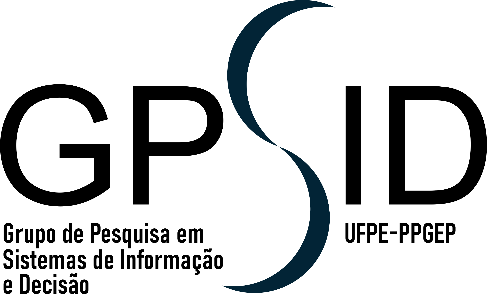

# 🌐 GPSID - Grupo de Pesquisa em Sistemas de Informação e Decisão
### Universidade Federal de Pernambuco (UFPE) — Recife

---

## 👩‍🏫 Coordenação

**MAÍSA MENDONÇA SILVA**  

  
📧 maisa.silva@ufpe.br

---

## 🎓 Mestrado

**CHARDSONCLEY JOSÉ CORREIA DA SILVA MELO**  

---

## 🎓 Doutorado

**CARLOS JOSÉ DE LIMA**  
  
📧 carlos.jlima@ufpe.br  

**EDUARDO DA SILVA**  

  
📧 eduardo.es@ufpe.br  

**JEFFERSON CARLOS DE OLIVEIRA RIBEIRO COSTA**  
  
📧 jefferson.ribeiro@ufpe.br  

**JOÃO BATISTA MENDES BARBOSA**  
  
📧 joao.mendes@ufpe.br  

**JOVENILSON ROCHA DE OLIVEIRA**  

**JOYCE NUNES GALVÃO CAVALCANTE**  
  
📧 joyce.nunes@ufpe.br  

**MARCOS ANTÔNIO ARAÚJO DA COSTA**  
  
📧 marcos.acosta@ufpe.br  

**MARIA DO LIVRAMENTO MAMEDE BEZERRA**  
  
📧 marialivramento.bezerra@ufpe.br  

**MATEUS MULLER FRANCO**  

---

## 🤝 Coorientações

**DANILO CESAR VITORINO DE ARRUDA**  

**PAULA CRISTINA DE AMORIM ANDRADE**  

---

<i>© GPSID – Grupo de Pesquisa em Sistemas de Informação e Decisão</i> 
<a href="mailto:labgpsid@gmail.com">labgpsid@gmail.com</a>

